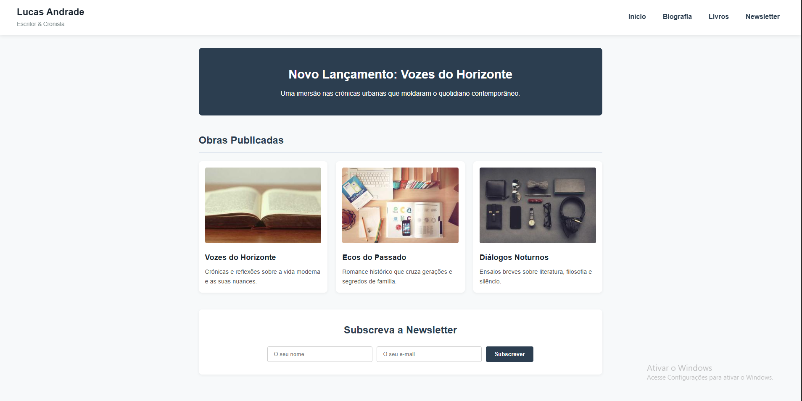
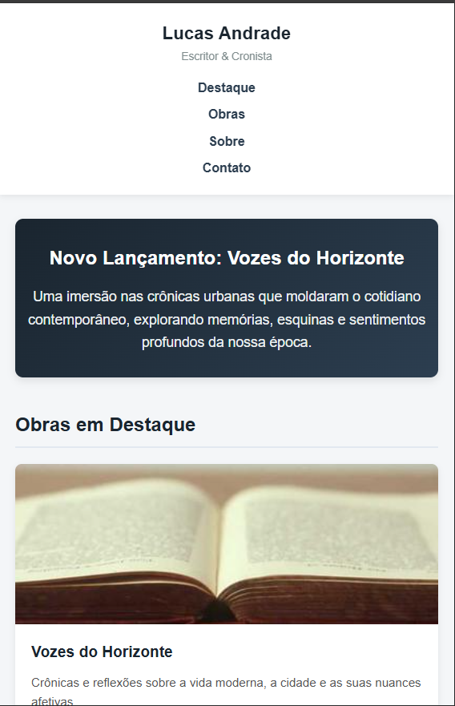

# Projeto Web: Home-Page Responsiva (Semana 5)

- **Nome:** Felipe Lopes dos Santos Lima
- **Matrícula:** 935890
- **Versão:** v1.0 (CSS Puro com Responsividade)

## Descrição
Evolução da home-page do escritor Lucas Andrade, implementando layout responsivo com CSS puro (Grid, Flexbox e Media Queries) que se adapta entre desktop (múltiplas colunas) e dispositivos móveis (coluna única).

## Versão Desktop

## Versão Mobile
